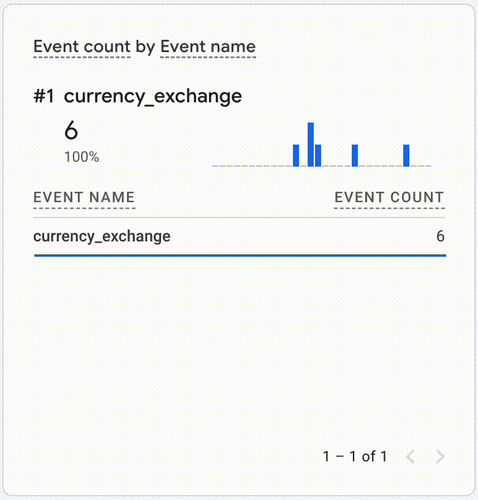

# User Metrics Monitoring System

This project is a user metrics monitoring system that tracks the UAH/USD exchange rate and sends this data to Google Analytics using the Google Analytics 4 (GA4) Measurement Protocol. The system fetches the exchange rate from the National Bank of Ukraine every hour and logs the data as events in Google Analytics.



## Prerequisites

- Rust (latest stable version)
- Cargo (Rust package manager)
- Google Analytics 4 account

## Installation

1. **Set up environment variables:**

    Create a `.env` file in the root directory and add the following environment variables:

    ```env
    MEASUREMENT_ID=your_ga4_measurement_id
    API_SECRET=your_ga4_api_secret
    ```

2. **Install dependencies:**

    ```sh
    cargo build
    ```

3. **Usage**

    To run the user metrics monitoring system, use the following command:

    ```sh
    cargo run
